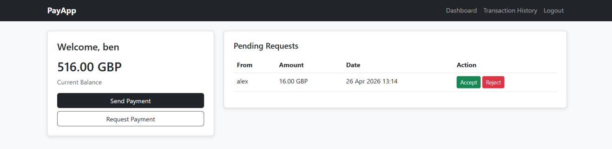
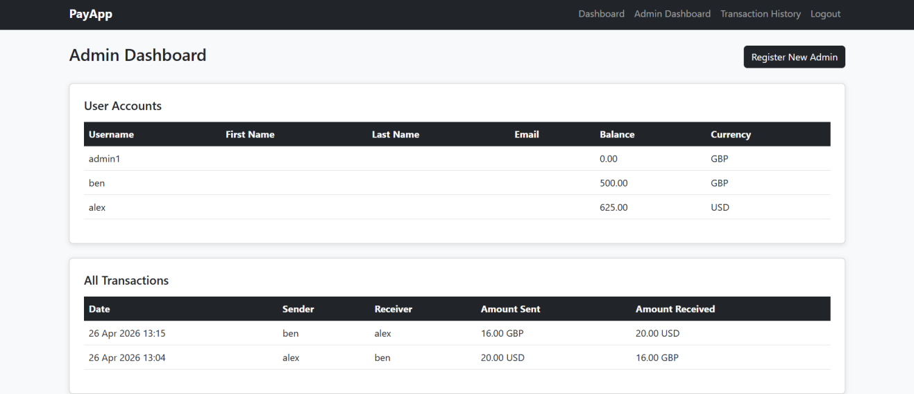
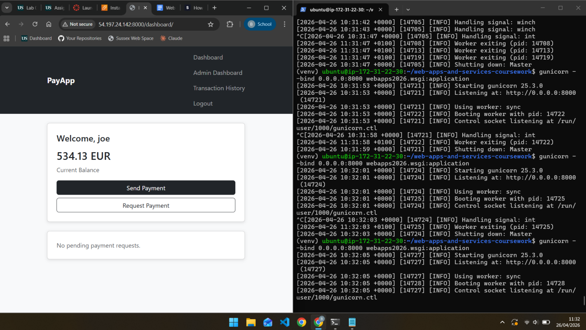

# PayApp

### A PayPal-inspired Django Web Application



## Features

- User registration, login, and logout
- Send payments to other registered users
- Request payments from other registered users
- Automatic currency conversion using a REST API
- Transaction history with sent and received payments
- User balances and account management
- Admin dashboard for viewing users and transactions
- In-app registration of new administrators
- Access control for authorized users and administrators
- CSRF, XSS, SQL injection, and clickjacking protection

## About

**PayApp** is a PayPal-inspired web application developed using **Django**. The application allows registered users to send and request payments from other users while supporting multiple currencies through an integrated REST conversion service.

Users are provided with an initial balance and can select their preferred currency when registering. Currency conversion is automatically handled when users with different currencies interact with each other.

The application also includes an administrative dashboard where authorized administrators can view user accounts, balances, and payment transactions, as well as register additional administrators.



*Admin dashboard displaying all registered accounts and transactions.*

## Technology

- **Language:** Python
- **Framework:** Django
- **Web Service:** REST API
- **Database:** SQLite
- **Frontend:** HTML, CSS, Bootstrap
- **Deployment:** AWS EC2
- **Version Control:** Git

## Development

The application was structured around separate presentation, business logic, data access, security, and web service layers.

Django models were used to manage application data, including user accounts and transactions. Authentication and access control were implemented using Django's authentication system, including `@login_required` and `@staff_member_required`.

The application also includes protection against common web vulnerabilities. Django templates and CSRF tokens were used to help prevent XSS and CSRF attacks, while Django's built-in protections were used for SQL injection and clickjacking.

## Currency Conversion

PayApp includes a REST service for converting between supported currencies.

For example:

```text
/api/conversion/GBP/USD/100/
```

The conversion service is used when users with different currencies send or request payments. It is also used when assigning the initial account balance during registration.

## Running the Application

Create and activate a Python virtual environment, then install the project's dependencies:

```bash
python3 -m venv venv
source venv/bin/activate
pip install -r requirements.txt
```

The Django application can then be started using:

```bash
python manage.py runserver
```

The project was also deployed to an **AWS EC2** instance using Gunicorn.

